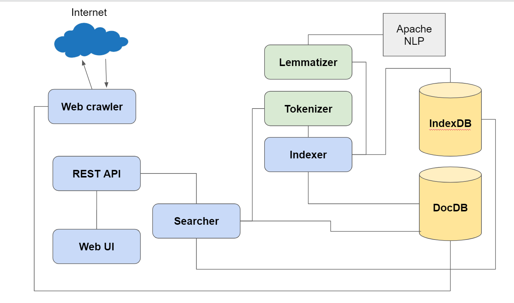

# Web Search Engine
This is my attempt at creating a minimalistic search engine as a practical way to learn about information retrieval. I wanted to create a full-stack search system all the way from indexing and searching in Java to a clear REST API with a user-friendly frontend in Angular. Some ideas and algorithms are borrowed from a great text book on everything related to search: [Introduction to Information Retrieval](https://nlp.stanford.edu/IR-book/information-retrieval-book.html).

As a test, I crawled and indexed the entire JavaDocs website with around 10k documents and over 35k unique terms.

The resulting system consists of the following modules:

+ Multithreaded Web crawler (crawls a single site with a single seed url)
+ Scalable block-sort based indexer
+ Document text tokenizer with stop word processing
+ Lemma extraction using Apache OpenNLP - natural text processing library
+ Fast searcher with dynamic document scoring and term highlighting. 
+ Scalable NoSQL storage using MongoDB (although, thanks to the inversion of control pattern, any other custom storage mechanism can be used)
+ REST API for search and term prefix autocompletion
+ Frontend written in Angular

During development I had a chance to implement a number of interesting practical algorithms, such as:

+ Compact binary file storage for index postings lists
+ External sorting with intermediate files, including k-way merge using priority queue, during index construction
+ Multi-threaded web crawling using the BFS pattern
+ Generating a relevant text snippet with term highlighting for a specific user search query (interval merging etc.)
+ Fast term autocompletion by using trie-based prefix search
+ Vector space model for scoring query-to-document similarity

## How to run

You need Java 8 or higher installed on your computer. Launch scripts are currently implemented only for the Windows platform.
You will also need an instance of MongoDb running on your machine. All launch scripts run against MongoDb database on localhost.
It is recommended that you use the same database for index and document storage.

If you want to use a different storage implementation or store data on a remote MongoDb server, then you will need to modify App.java files in corresponding projects and rebuild.

1. Build the project using maven command: `mvn clean install`
2. To crawl from a single seed URL launch the following script: `/web-crawler/target/run-web-crawler.bat [dbName] [seedUrl]`. E.g. `/web-crawler/target/run-web-crawler java-docs-db https://docs.oracle.com/javase/8/docs/api/overview-summary.html`
3. Once crawling is complete, you can run the indexer by entering: `/indexer/target/run-indexer.bat [dbName]`
4. Now that the index is built, launch the REST API by entering: `mvn spring-boot:run` inside search-rest-api folder. Set correct db.name value in application.properties file.
5. Finally, launch Angular frontend by issuing: `ng serve --open` inside search-angular-app folder.

## A few desirable improvements
Some of the aspects of the system that can be improved are listed below.
### Experiment with different scoring schemes for documents
Search results in the current implementation are not always the most relevant (see NullPointerException discussion below). The best match sometimes appears lower or at the bottom of the list and this is not optimal. 
### Weigh terms that occur in the document title higher that those that occur in the body
Currently, if you search for NullPointerException in the JavaDocs corpus, you get a lot of irrelevant hits as this particular term is mentioned in a great number of documents. This makes it difficult to assign a fair score to this term. But if the searcher pays special attention to terms occurring in document title, then the page about NullPointerException will be at the top, as it should.
### Crawl the web using several seed URLs and implement URL filtering
Sometimes a single seed URL is not enough to discover the whole site or a group of sites. So it is a good idea to have multiple seed URLs. 
URL filtering based on a pattern is also beneficial. Say you want to crawl the entire English Wikipedia. Then you are only interested in pages following this pattern: https://en.wikipedia.org/wiki/[article-name]. But you want to ignore pages with metadata e.g. https://en.wikipedia.org/wiki/Portal:Current_events or https://en.wikipedia.org/wiki/Special:WhatLinksHere/Java_(programming_language). These pages are not interesting for indexing.
### Pay attention to robots.txt
Current implementation of the crawler is not very polite.
### Make search REST API more production grade
Implement logging, security, API rate limiter, etc.
